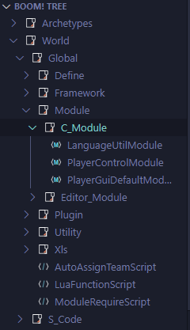

# Boom! Party for VS Code 

达芬奇计划，VS Code 插件开发版

## 安装
本插件可以在微软Vscode插件商店中搜索`Boom! Party`进行安装

## 功能
- [x] 树状图
- [x] 代码格式化
- [ ] 静态检查
- [ ] 代码补全
- [ ] excel转lua

### 树状图

根据工作区打开的文件夹生成对应节点层级的树状图，并显示跟编辑器内一样的脚本文件节点名

### 代码格式化

